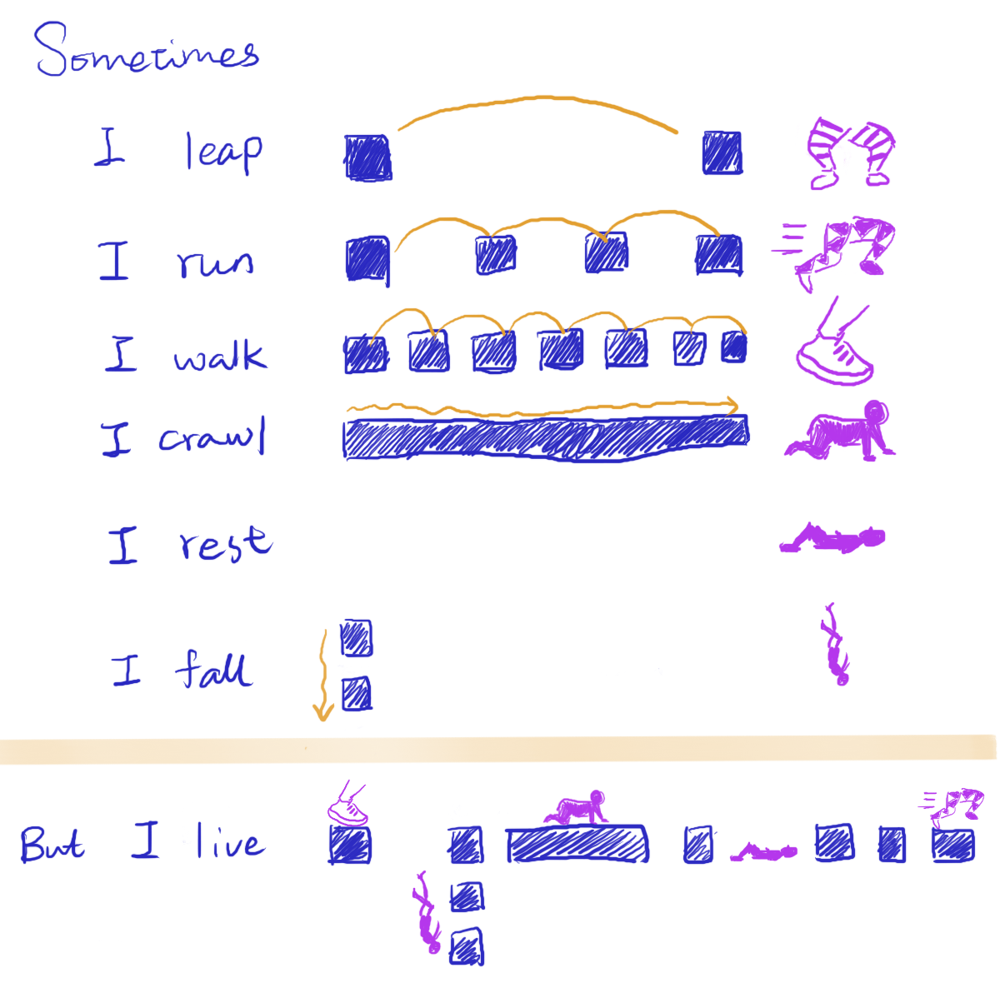

Once, I pictured patience as a tranquil ocean wave on a brisk day, effortlessly embracing serenity. But the shifting tides in life have reshaped my understanding.
I learn that you can still tear down, freak out, and fall apart, but you let it be. You let yourself be, and you let them be. You bypass those judgments, even if they might be right.

You wait. You wait. You wait. You wait till the next stillness comes, and so does the way you wait for the next storm. You practice patience even though you much prefer to be efficient, but you empathize, so you embrace and ensure they all have time and space to breathe.

One day, you might finally learn that, patience is looking for an entrance, not an answer.